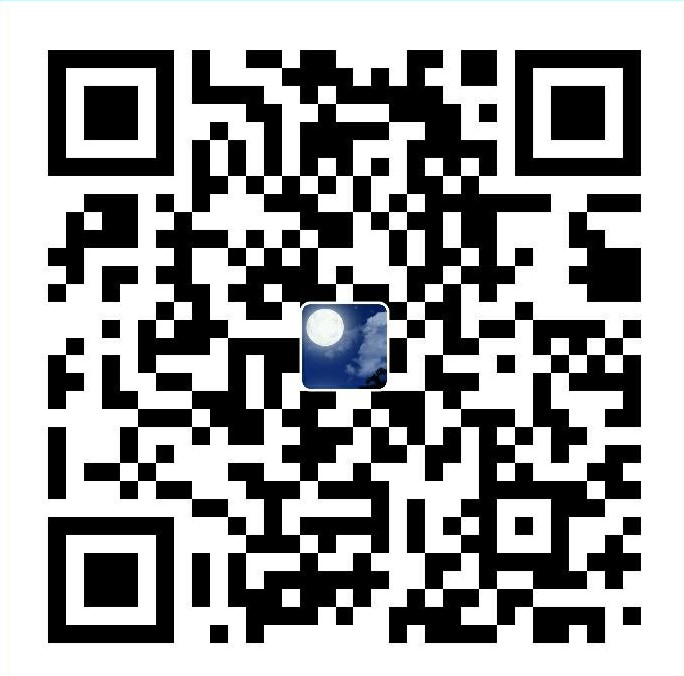

If these help you, please donate via the AliPay code below.

(**)

---

<ul class="listing">

  {{post.date | date:"%Y"}}
  
    
    <li class="listing-seperator">{{ y }}</li>
  
  <li class="listing-item">
    <time datetime="{{ post.date | date:"%Y-%m-%d" }}">{{ post.date | date:"%Y-%m-%d" }}</time>
    <a href="{{ post.url }}" title="{{ post.title }}">{{ post.title }}</a>
  </li>

</ul>

